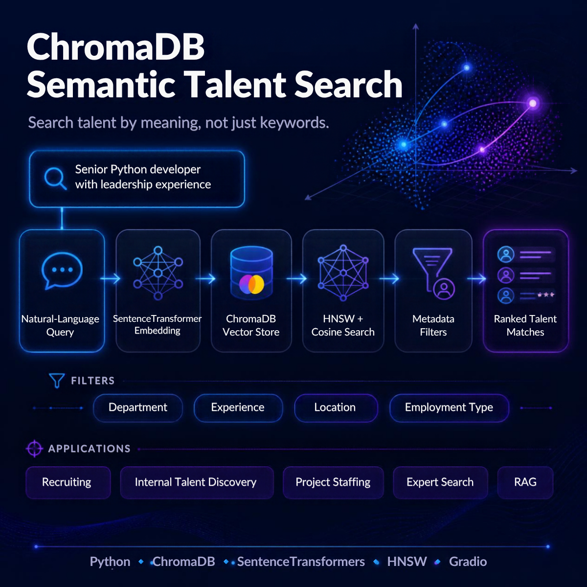
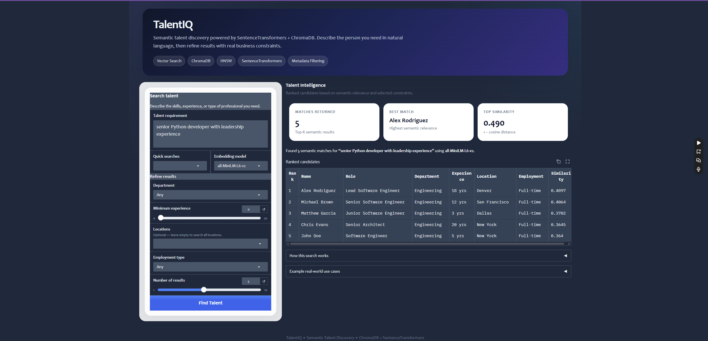

# ChromaDB Semantic Talent Search

## Application Poster


<p align="center">
  
</p> 

A semantic employee-search application that combines **vector similarity retrieval** with **structured metadata filtering**.

Instead of requiring exact job-title or keyword matches, users can describe the type of employee or candidate they need in natural language.

```text
"senior Python developer with leadership experience"
```

The query is embedded, searched against employee profiles in ChromaDB, and then refined using filters such as department, experience, location, and employment type.

## Why this matters

Traditional talent search often relies on rigid keywords. Semantic retrieval can surface relevant profiles even when the wording differs.

```text
Natural-language requirement
        ↓
SentenceTransformer
        ↓
Query Embedding
        ↓
ChromaDB Vector Store
        ↓
HNSW Similarity Search
        ↓
Semantic Candidate Matches
        ↓
Metadata Filters
        ↓
Ranked Top-K Results
```

## Core capabilities
- Semantic candidate search
- Minimum-experience filters
- Department filters
- Location filters
- Employment-type filters
- Top-K retrieval
- Persistent ChromaDB storage
- Multiple embedding-model profiles
- Interactive Gradio interface

## Example combined search

```text
Requirement: "senior Python developer full-stack"
Experience: 8+ years
Locations: San Francisco, New York, Seattle
```

## Application Preview


<p align="center">
  
</p>

## Repository Structure

```text
chromadb-employee-talent-search/
├── app.py
├── cli.py
├── README.md
├── PORTFOLIO.md
├── EXPERIMENTS.md
├── requirements.txt
├── assets/
└── src/
    ├── __init__.py
    ├── data.py
    ├── vector_store.py
    └── search_service.py
```

## Run

```bash
python -m venv .venv
pip install -r requirements.txt
python app.py
```

## Real-world applications
- Internal talent discovery
- Recruiting candidate retrieval
- Skills matching
- Project staffing
- Expert-finder systems
- Mentorship matching
- Internal mobility tools
- Workforce planning

## Why metadata still matters

Embeddings answer: **Which profiles are semantically relevant?**

Metadata filters answer: **Which relevant profiles also satisfy hard business constraints?**

That distinction is important in production retrieval systems.

## Future Roadmap
- Larger synthetic employee dataset
- Retrieval evaluation with Hit@K / MRR / nDCG
- Hybrid lexical + vector retrieval
- Reranking
- Resume/profile ingestion
- Skills extraction and enrichment
- RAG-based recruiting assistant

## Skills Demonstrated
`Python` · `ChromaDB` · `Vector Databases` · `SentenceTransformers` · `Embeddings` · `HNSW` · `Cosine Similarity` · `Semantic Search` · `Metadata Filtering` · `Gradio`

## Acknowledgment
The foundational employee-search exercise originated in coursework. This repository restructures and extends it into a modular semantic talent-discovery application for experimentation and portfolio development.
