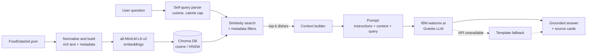

# 🍽️ Food Recommendation RAG

**Semantic food search, metadata filtering and a retrieval-augmented chatbot, built with IBM watsonx.ai (Granite), Chroma DB, Sentence Transformers and Gradio.**

[](https://github.com/<your-username>/food-rag-recommender/actions)


> 🚀 **Live demo:** _add your Hugging Face Space link here_

<!-- Add a screenshot or GIF after you run the app: docs/demo.png -->
<!--  -->

Ask *"What Italian dishes do you recommend under 400 calories?"* and the app:

1. **parses** the question for constraints (cuisine = Italian, calories ≤ 400),
2. **retrieves** the most semantically similar dishes from a Chroma vector index, filtered by those constraints,
3. **generates** a grounded, conversational recommendation with **IBM Granite on watsonx.ai**,
4. **shows its sources**, the retrieved dishes, so every answer can be checked.

## 🧰 Tech stack

| Layer | Tool |
|---|---|
| LLM (generation) | **IBM watsonx.ai**: `ibm/granite-4-h-small` via the `ibm-watsonx-ai` SDK |
| Embeddings | `all-MiniLM-L6-v2` (Sentence Transformers, runs locally) |
| Vector database | Chroma DB (cosine similarity, HNSW index, metadata filters) |
| Web UI | Gradio |
| Testing / CI | pytest + GitHub Actions |

---

## ✨ Features

| Tab | What it does | Technique |
|---|---|---|
| 🔍 **Discover** | Free-text food search ("sweet treats", "spicy noodles") | Dense vector similarity search (cosine, HNSW) |
| 🎛️ **Advanced Search** | Filter by cuisine(s), max calories, min protein, cooking method, required ingredient | Chroma `where` filters (`$and`, `$in`, `$lte`, `$gte`) plus an ingredient post-filter |
| 🤖 **AI Food Chat** | Natural-language recommendations with conversation memory and a live "retrieved context" panel | RAG with self-query constraint extraction and automatic filter relaxation |
| ⚖️ **Compare** | Contrast two cravings ("chocolate dessert" vs "healthy breakfast") | Two retrievals + one LLM comparison |
| ℹ️ **How it works** | Architecture overview inside the app | — |

A terminal version (`cli.py`) of the three original systems is included too.

## 🏗️ Architecture



**Why each piece is there**

- **Rich documents:** each dish is embedded as one text block (name, description, ingredients, cuisine, cooking method, taste and texture, health benefits, macros), so queries like *"crispy and sweet"* or *"good for workout recovery"* match on more than the name.
- **Flat metadata:** calories, protein, carbs, fat, cuisine and cooking method are stored as typed metadata, so filtering happens *inside* the vector DB rather than after the search.
- **Self-querying retrieval:** constraints in the question are turned into filters. If they remove every result, the search is retried without them, so the user always gets an answer.
- **Grounded prompting:** the LLM is told to recommend only retrieved dishes, and the UI shows those dishes next to every answer.
- **Graceful degradation:** with no API key, or if the LLM call fails, a template answer is built from the top results, so the demo never breaks.

## 🚀 Quickstart

```bash
git clone https://github.com/<your-username>/food-rag-recommender.git
cd food-rag-recommender
python -m venv .venv && source .venv/bin/activate   # Windows: .venv\Scripts\activate
pip install -r requirements.txt

cp .env.example .env      # then add your watsonx.ai credentials (see below)
python app.py             # open http://127.0.0.1:7860
```

The first run downloads the `all-MiniLM-L6-v2` embedding model (about 90 MB) and indexes the dataset in a few seconds.

### 🔑 Connecting IBM watsonx.ai

The chatbot's answers are generated by IBM's **Granite** model on watsonx.ai. To run it with your own account:

1. Sign in to [IBM Cloud](https://cloud.ibm.com) and open **watsonx.ai**.
2. Create a **project** and make sure a Watson Machine Learning service is associated with it.
3. Copy the **Project ID** from the project's **Manage → General** page.
4. Create an **API key** under **Manage → Access (IAM) → API keys**.
5. Put both in `.env`:

```env
LLM_PROVIDER=watsonx
WATSONX_APIKEY=your-ibm-cloud-api-key
WATSONX_PROJECT_ID=your-project-id
WATSONX_URL=https://us-south.ml.cloud.ibm.com     # use your project's region
WATSONX_MODEL_ID=ibm/granite-4-h-small
```

The app header shows `LLM: watsonx · ibm/granite-4-h-small` once it's connected. Model availability differs by region, so if that model isn't offered in yours, set `WATSONX_MODEL_ID` to another Granite model from the watsonx.ai model catalog.

The connection lives in [`food_rag/llm.py`](food_rag/llm.py):

```python
from ibm_watsonx_ai import Credentials
from ibm_watsonx_ai.foundation_models import ModelInference

model = ModelInference(
    model_id="ibm/granite-4-h-small",
    credentials=Credentials(url=WATSONX_URL, api_key=WATSONX_APIKEY),
    project_id=WATSONX_PROJECT_ID,
    params={"max_new_tokens": 400},
)
answer = model.generate(prompt=prompt)["results"][0]["generated_text"]
```

> 🔒 Never commit your `.env` file. It's already in `.gitignore`. For a hosted demo, add the keys as secrets instead (see the deployment section).

<details>
<summary>Other LLM options (optional)</summary>

The LLM layer is swappable, so the project also runs without watsonx:

| Option | Set in `.env` |
|---|---|
| OpenAI / Groq / Together | `LLM_PROVIDER=openai`, `OPENAI_API_KEY` (+ `OPENAI_BASE_URL`, `OPENAI_MODEL`) |
| Local Ollama (free) | `LLM_PROVIDER=openai`, `OPENAI_API_KEY=ollama`, `OPENAI_BASE_URL=http://localhost:11434/v1`, `OPENAI_MODEL=llama3.1` |
| No LLM | nothing: answers are built from a template using the retrieved dishes |

</details>

### Command-line mode

```bash
python cli.py search     # interactive similarity search
python cli.py advanced   # cuisine / calorie filtered search
python cli.py chat       # RAG chatbot (type 'compare' to compare two queries)
```

## 📁 Project structure

```
food-rag-recommender/
├── app.py                  # Gradio web app (5 tabs)
├── cli.py                  # Terminal version of the three systems
├── food_rag/
│   ├── config.py           # Env-driven settings
│   ├── data.py             # Load / normalise data, build documents and metadata
│   ├── vector_store.py     # Chroma collection creation and population
│   ├── search.py           # Semantic search, filters, self-query parser
│   ├── llm.py              # IBM watsonx.ai Granite client (+ optional backends)
│   ├── rag.py              # Context building, prompting, fallbacks, comparison
│   └── render.py           # HTML result cards and CSS
├── data/FoodDataSet.json   # 50 dishes across 10 cuisines
├── tests/                  # Unit tests (run without downloading any model)
├── .github/workflows/      # CI: pytest on every push
├── requirements.txt
└── .env.example
```

## 🧪 Tests

```bash
pip install -r requirements-dev.txt
pytest -q
```

The tests use a small in-memory stand-in for the Chroma collection (bag-of-words cosine plus Chroma's `where` operators), so data handling, filter building, self-query parsing, RAG prompting, LLM fallbacks and HTML escaping are all tested in CI in under a second.

## 📊 Dataset

Each record follows this schema:

```json
{
  "food_id": 1,
  "food_name": "Apple Pie",
  "food_description": "A classic dessert made with a buttery, flaky crust...",
  "food_calories_per_serving": 320,
  "food_nutritional_factors": {"carbohydrates": "42g", "protein": "2g", "fat": "16g"},
  "food_ingredients": ["Apples", "Flour", "Butter", "Sugar", "Cinnamon", "Nutmeg"],
  "food_health_benefits": "Rich in antioxidants and dietary fiber",
  "cooking_method": "Baking",
  "cuisine_type": "American",
  "food_features": {"taste": "sweet", "texture": "crisp and tender", "appearance": "golden brown",
                    "preparation": "baked", "serving_type": "hot"}
}
```

The bundled `data/FoodDataSet.json` is a curated sample in this schema. To use a larger dataset, drop in any JSON file with the same fields and point `FOOD_DATA_PATH` at it. Missing fields are filled with safe defaults.

## ☁️ Deploy to Hugging Face Spaces (free)

1. Create a new **Gradio** Space and push this repo to it.
2. Add this front-matter at the top of the Space's `README.md`:
   ```yaml
   ---
   title: Food RAG Recommender
   emoji: 🍽️
   colorFrom: orange
   colorTo: green
   sdk: gradio
   app_file: app.py
   ---
   ```
3. Under **Settings → Variables and secrets**, add `WATSONX_APIKEY` and `WATSONX_PROJECT_ID` as **secrets**, and `LLM_PROVIDER=watsonx` (plus `WATSONX_URL` if your project isn't in us-south) as variables.

## 🔧 What I changed from the original lab

This project started as the IBM Skills Network lab *"Interactive Food Search and RAG Chatbot System"* (three CLI scripts). I rebuilt it as an application:

- **Gradio web UI** in place of three separate `input()` loops, with result cards, sliders, multi-select filters and a sources panel.
- **A modular package** (`data → vector_store → search → rag → llm`) in place of a `from shared_functions import *` script.
- **IBM watsonx.ai with your own credentials:** the lab's hard-coded Skills Network project is replaced by a `.env` config, so Granite runs from any machine or hosted demo. The LLM layer is swappable (OpenAI-compatible or local Ollama) if needed.
- **Self-querying retrieval:** calorie caps and cuisines in a chat message become Chroma filters, with automatic relaxation.
- **Richer filters:** multi-cuisine `$in`, minimum protein, cooking method and ingredient matching.
- **Conversation memory:** recent turns are passed to the LLM so follow-ups like *"something lighter"* work.
- **Bug fix:** the lab's search results didn't carry ingredients, health benefits or cooking method, so the RAG context builder silently left them out. They now reach the prompt.
- **Grounding guardrail:** the prompt tells the LLM to recommend only retrieved dishes.
- **Tests + CI**, env-based config, and HTML escaping of all rendered data.

## 🗺️ Possible next steps

- Hybrid search (BM25 + dense) and a cross-encoder re-ranker
- Retrieval evaluation (hit-rate / MRR on a labelled query set)
- Dietary tags (vegan, gluten-free) as filterable metadata
- Streaming LLM responses in the chat tab

## 🙏 Acknowledgements

Based on the IBM Skills Network practice project *Interactive Food Search and RAG Chatbot System* by Wojciech "Victor" Fulmyk, licensed under [Apache 2.0](LICENSE). This repository is also released under Apache 2.0.
